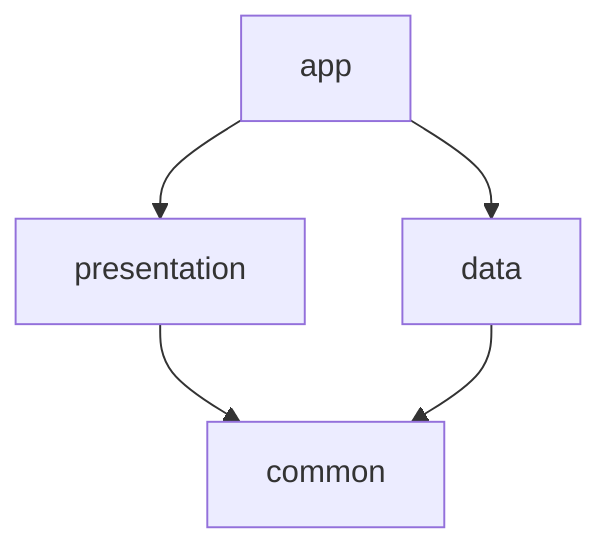

# eromoro-mobile

이로모로 서비스의 안드로이드 클라이언트 리포지토리입니다.

## 🚀 주요 라이브러리

| 분류                     | 라이브러리                    | 역할                               |
| :----------------------- | :---------------------------- | :--------------------------------- |
| **UI**                   | Jetpack Compose               | 선언형 UI 툴킷                     |
| **Architecture**         | AndroidX ViewModel, Lifecycle | UI 관련 데이터의 생명주기 관리     |
| **Dependency Injection** | Hilt                          | 컴파일 타임 의존성 주입 프레임워크 |
| **Asynchronous**         | Coroutines                    | 비동기 프로그래밍 지원             |
| **Navigation**           | Navigation-Compose            | Compose 앱의 화면 이동 관리        |
| **Networking**           | OkHttp3                       | 원격 서버와의 HTTP 통신 및 로깅    |
| **Image Loading**        | Coil                          | 이미지 로딩 및 캐싱                |
| **Map**                  | Naver Map Compose             | 네이버 지도 연동                   |
| **Permissions**          | Accompanist Permissions       | 런타임 권한 요청 처리 간소화       |

## 🏛️ 디자인 패턴

프로젝트는 다음 앱 아키텍처 가이드를 따릅니다.

- **Clean Architecture**
- **Repository Pattern**
- **MVVM (Model-View-ViewModel)**

이 프로젝트는 기능과 역할에 따라 여러 모듈로 나뉘어 있습니다. 이는 클린 아키텍처를 기반으로 하며, 각 모듈의 독립성과 재사용성을 높입니다.

- **`app`**: 최종 안드로이드 애플리케이션을 구성하고 모든 모듈을 통합하는 메인 모듈입니다. Navigation 연결, 앱의 진입점과 관련된 코드를 포함합니다.
- **`presentation`**: UI와 관련된 모든 코드를 포함합니다. Jetpack Compose로 작성된 화면의 집합입니다.
- **`data`**: 데이터 소스(원격 API, 로컬 DB)와의 통신을 담당합니다. Repository 구현체, API 서비스, DTO(Data Transfer Object) 등을 포함합니다.
- **`common`**: 여러 모듈에서 공통으로 사용되는 유틸리티 클래스, 확장 함수, 상수 등을 포함하는 모듈입니다.
